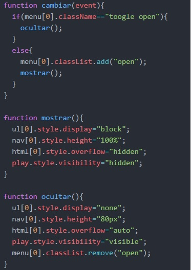
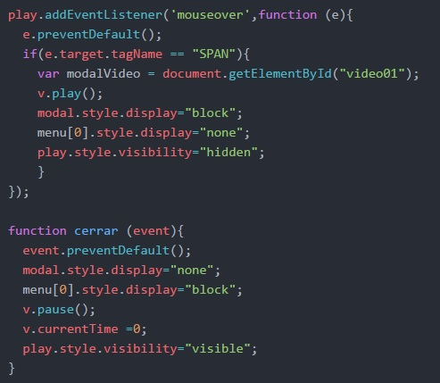
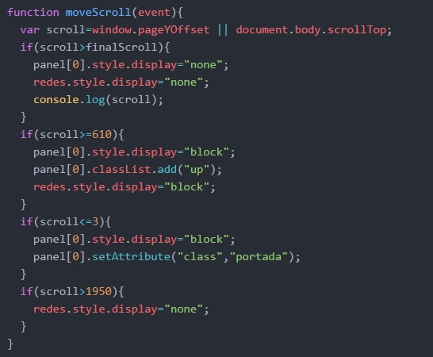
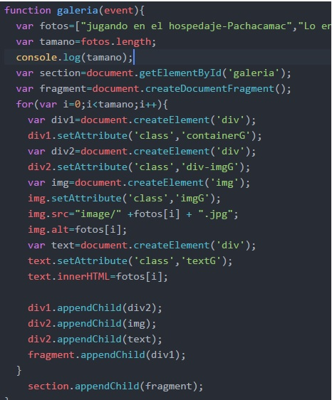
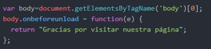
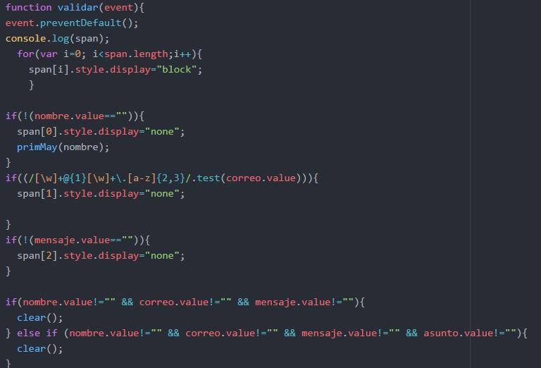
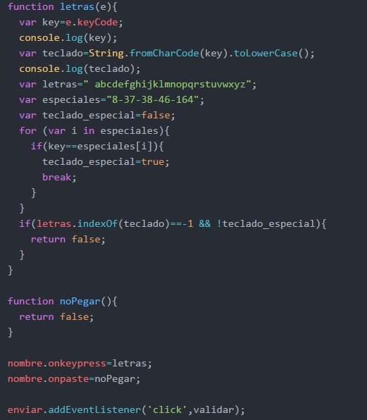

# Can-pamento
Es un ejemplo de una página web dedicada al cuidado integral de los caninos, cuenta con diversos servicios (hospedaje, guardería, moda canina y grooming. El cliente nos solicita ciertos requerimientos, los cuales se detallan a continuación:

- Header: Aquí se encuentra el menú de navegación, tiene un menú tipo hamburguesa, cuenta con las funcionalidades de dirigirnos a lo solicitado por el usuario.
- Section de Servicios: Esta section cuenta con animacion en css, usamos transition y transform en 2d.Cuenta con imágenes y texto relacionado a la misma.
- Section de Galeria: Esta sección tiene 8 fotos generadas desde JS por pedido del cliente pues será algo que actualizará de forma recurrente. Aquí empleamos el createElement,setAttribute, DocumentFragment() y appendChild.
- Section de contacto: Aquí realizamos un formulario sencillo con validación por js. No se permite el ingreso de números, permite espacios, no deja pegar números (evento onpaste). Si se coloca una información incorrecto o el campo esta vacío y es obligatorio saldrá un tooltip.
- Extras del Header: Tenemos un video en esta section, que activa un modal al evento onmouseover y se activa el método play.Al hacer click en "x" se cierra el modal, el video se pausa por el método pause y regresa a 0 segundos por la propiedad currentTime.
- Extras del Menú: Por medio del evento onscroll podemos ocultar el menú y vuelve a aparecer despúes de cierto recorrido.
- Extras de Redes: Por medio del evento onscroll podemos ocultar y mostrar las redes que se encuentran fijas en la pantalla. 

## Funcionalidades en JS
------------------------

### Para el menú hamburguesa.
Para hacer el cambio de forma del toogle y que se muestre/oculte el contenido hemos utilizado la function cambiar. Se detalla el script en la imagen.

### Function del video.
 Esta función se encarga de reproducir el video, lo hace al colocar el mouse sobre el icono de reproducir, aparece una ventana modal y 
 se coloca play inmediatamente. Al cerrar la ventana se pausa el video y se reinicia.

### Funcionalidad del scroll.
 Al recorrer la página por medio del scroll se ejecutará la función que muestra/oculta la barra de navegación y las redes sociales a un lado de la pantalla.

### Funcionalidad de la galeria.
 Esta se crea desde js. Se usa createElement, setAttribute, DocumentFragment(). 

### Funcionalidad del evento abandonar página.
 Al querer abandonar la pa´gina desata un evento y se te preguntará si deseas salir.
 

### Function validar.
 En esta función no se permite que se digiten números en el input de nombre, tampoco permite que copie ningún contenido al mismo. Valida que el formato del correo sea en correcto.Se valida que no estén vacíos los campos de nombre, correo y mensaje. Aparece un tooltip en el casillero vacío o incorrecto.

### Función para el evento onkeypress y onpaste.
 Se han creado funciones que se ejecutan dependiendo del evento. En el onkeypress se ejecuta una función que no permite el ingreso de números. En el onpaste no te permite pegar contenido

## Autoras: Erika Vidal y Stephanie Hiyagon.
